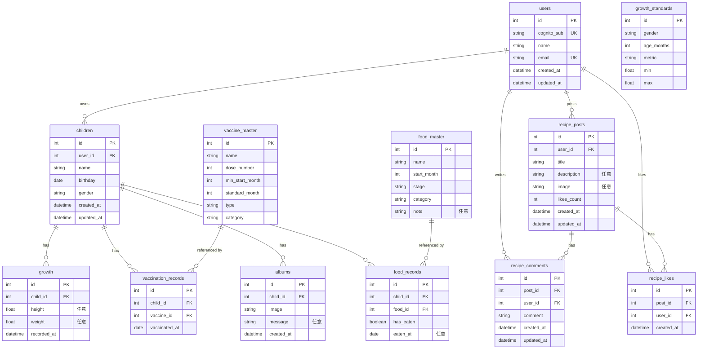

# growth-diary-back

子供の成長日記アプリのバックエンド（Fastify + Prisma + PostgreSQL）。

## 技術スタック

- Node.js 22（Lambda の `nodejs22.x` とメジャーバージョンを統一）
- Fastify 5
- Prisma 7（`prisma-client` ジェネレータ / ESM / pg アダプタ）
- PostgreSQL 16（Docker コンテナ）

## DB構成（ER図）

`prisma/schema.prisma` の現状テーブルをもとにした ER 図（GitHub 上では図として表示されます）。`growth_standards` は他テーブルと関連を持たないマスタ。



> `recipe_likes` は `(post_id, user_id)` の複合ユニーク制約あり（同じ投稿への重複いいねを防止）。各 FK は子側を `onDelete: Cascade`。

## 起動手順（Docker）

```bash
# 1. コンテナをビルドして起動（app + db の2コンテナ）
docker compose up --build

# 2. 別ターミナルで、DBにテーブルを作成（初回のみ）
docker compose exec app npx prisma migrate dev --name init

# 3. 動作確認
curl http://localhost:3000/health
# -> {"status":"ok"}
```

停止は `docker compose down`、DBのデータも消すなら `docker compose down -v`。

## Git / GitHub 連携手順（HTTPS）

`.gitignore` を用意した後にリポジトリを作る（`node_modules/` や `.env` の誤pushを防ぐ）。

```bash
git init
git add .
git commit -m "初期構成: Fastify+Prisma+PostgreSQL"
# GitHub に空リポジトリ growth-diary-back を作成してから:
git remote add origin <HTTPSのURL>
git push -u origin main
```

### コミットの区切り方（推奨）

1. `.gitignore追加`
2. `schema.prisma に#43設計の全テーブル定義`
3. `Dockerfile追加`
4. `compose.ymlでNode+PostgreSQL定義`
5. `compose up動作確認完了`

## 注意

- `.env` は DB接続情報を含むため push しない（`.env.example` のみ共有）。
- アプリは `0.0.0.0` で待ち受ける（コンテナ外からアクセスするため）。
