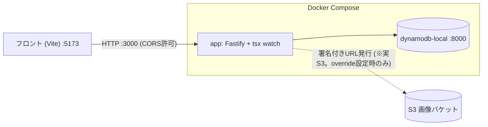
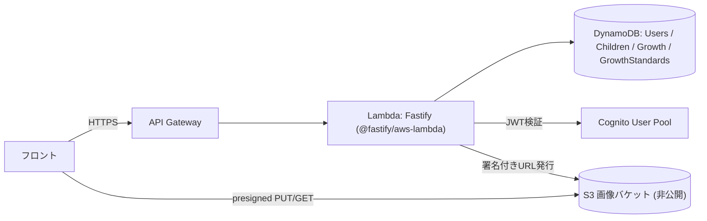
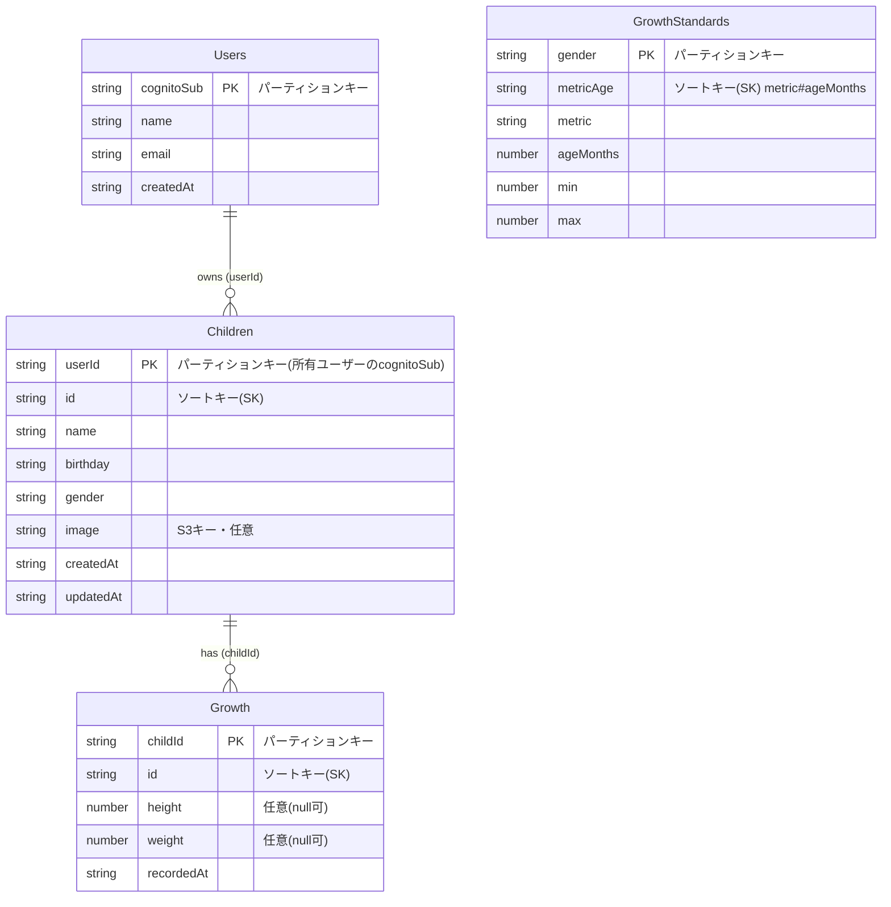
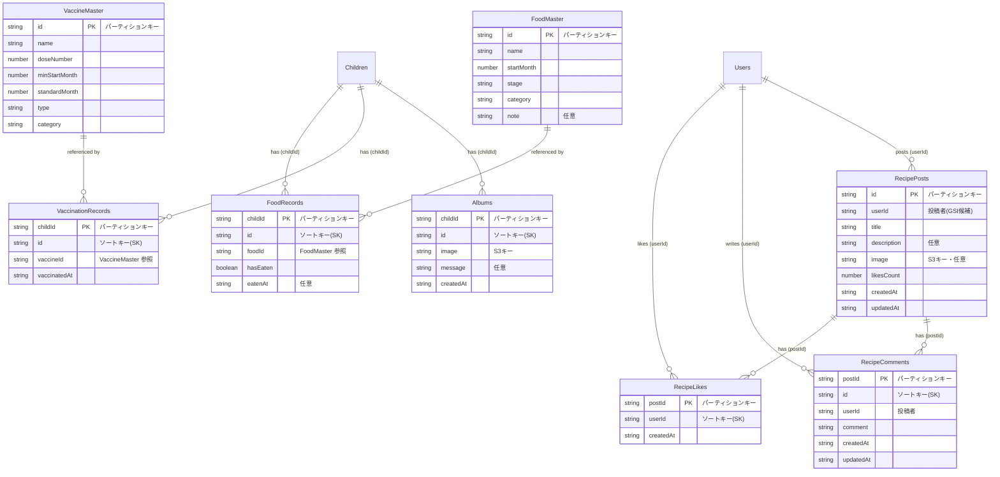

# growth-diary-back

子供の成長日記アプリのバックエンド。Fastify を AWS Lambda 上で動かし、データは DynamoDB、認証は Cognito、画像は S3 に保存するサーバーレス構成。

## 技術スタック

| 分類 | 採用 |
|---|---|
| 言語 / ランタイム | TypeScript / Node.js 22（Lambda `nodejs22.x` と統一） |
| Web フレームワーク | Fastify 5（Lambda では `@fastify/aws-lambda` 経由） |
| データストア | Amazon DynamoDB（1エンティティ1テーブル） |
| 認証 | Amazon Cognito（User Pool / JWT 検証は `aws-jwt-verify`） |
| 画像保存 | Amazon S3（非公開バケット・署名付き URL で入出力） |
| IaC / デプロイ | AWS SAM（API Gateway + Lambda + DynamoDB + Cognito + S3） |
| ローカル開発 | Docker Compose（app + DynamoDB Local） |
| テスト | Vitest + Testcontainers（実 DynamoDB Local を起動） |
| 開発実行 / ビルド | tsx（watch） / esbuild |

> 旧構成（Prisma + PostgreSQL）からサーバーレス構成へ移行済み。

## アーキテクチャ構成図

### ローカル（Docker Compose）



- 認証は `AUTH_MODE=dummy` で固定テストユーザーを使い、Cognito をスキップ。
- 画像アップロード/表示をローカルで実検証する場合のみ、実 S3 へ接続する `compose.override.yml`（後述）を使う。

### 本番（AWS / SAM）



- すべて `template.yaml`（SAM）で定義し `sam deploy` で構築。
- 画像はフロントが署名付き URL で **S3 へ直接** PUT/GET（Lambda を経由しない）。

## DB 構成（DynamoDB）

### 実装済み

1エンティティ1テーブル。`GrowthStandards` は他と関連を持たない発育曲線マスタ。キーは PK=パーティションキー / SK=ソートキー。



- DynamoDB には FK 制約が無いため、子供削除時の成長記録カスケード削除はアプリ側で行う。
- 子供削除・画像差し替え時は、紐づく S3 画像もアプリがベストエフォートで削除する。




> `RecipeLikes` は PK=postId / SK=userId の複合キーで同一投稿への重複いいねを自然に防ぐ想定。画像（`Albums.image` / `RecipePosts.image`）は既存の S3 + 署名付き URL の仕組みを共通利用する想定。

## ローカル開発のセットアップ

前提: Docker Desktop（WSL 利用時は WSL Integration を ON）。

```bash
# 1. コンテナ起動（app + dynamodb-local）
docker compose up -d

# 2. DynamoDB Local にテーブル作成＆初期データ投入（初回のみ）
docker compose exec app npm run db:setup
docker compose exec app npm run db:seed

# 3. 動作確認
curl http://localhost:3000/health   # -> {"status":"ok"}
```

- ソース変更はホットリロードされる（`tsx watch`。マウント越しでも拾えるよう `CHOKIDAR_USEPOLLING` でポーリング監視を有効化済み）。
- 停止は `docker compose down`、DynamoDB のデータも消すなら `docker compose down -v`。

### 画像アップロード/表示をローカルで検証する場合（任意）

ローカルの DynamoDB は dynamodb-local だが、S3 はエミュレータを使わず**実 S3 バケット**に接続して検証する。`compose.override.yml`（**.gitignore 済み・コミット禁止**）を作り、自分の AWS 認証情報と実バケット名を渡す:

```yaml
# compose.override.yml
services:
  app:
    environment:
      IMAGES_BUCKET: growth-diary-images-<AWSアカウントID>
      AWS_ACCESS_KEY_ID: "<自分のアクセスキー>"
      AWS_SECRET_ACCESS_KEY: "<自分のシークレット>"
      AWS_REGION: "ap-northeast-1"
```

作成後 `docker compose up -d`（再作成）で反映。不要になれば削除して `docker compose up -d` で元（dummy）に戻る。

## テスト

```bash
npm test   # Vitest（Testcontainers で DynamoDB Local を起動して実行）
```

- Docker が必要（Testcontainers がコンテナを起動するため）。
- 型チェックは `npm run typecheck`。

## 本番デプロイ（AWS SAM）

```bash
sam build
sam deploy   # samconfig.toml に設定済み（stack: growth-diary-back / region: ap-northeast-1）
```

- `template.yaml` が DynamoDB / Lambda / API Gateway / Cognito / S3 を一括で構築。
- デプロイ後の Outputs（`ApiUrl` / `UserPoolId` / `UserPoolClientId` / `ImagesBucketName`）で各リソースの値を取得できる。
- 本番は `AuthMode` を `dummy` 以外にすると実 Cognito 検証になる（既定は安全側で `dummy`）。

## API エンドポイント

認証必須（`Authorization: Bearer <Cognitoアクセストークン>`）。`/` と `/health` のみ公開。

| メソッド / パス | 内容 |
|---|---|
| `GET /` , `GET /health` | ヘルスチェック（公開） |
| `POST /children` , `GET /children` | 子供の作成 / 一覧 |
| `GET/PUT/PATCH/DELETE /children/:id` | 子供の取得 / 全置換 / 部分更新 / 削除 |
| `GET/POST /children/:childId/growth` | 成長記録の一覧 / 作成 |
| `PUT/PATCH/DELETE /children/:childId/growth/:id` | 成長記録の更新 / 削除 |
| `GET /children/:childId/growth-standards` | 発育曲線マスタの参照 |
| `POST /uploads/image-url` | 画像アップロード用の署名付き URL 発行 |

- 子供レスポンスには `image`（S3キー）に加え、表示用の署名付き GET URL `imageUrl` が付与される（画像が無ければ `null`）。
- 画像連携の詳細は [docs/api/image-upload-url.md](docs/api/image-upload-url.md) を参照。

## 認証モード

`AUTH_MODE` で切り替える（[.env.example](.env.example) 参照）。

- `dummy`（ローカル既定）… 固定テストユーザーで認証をスキップ。
- それ以外 … 本番扱い。`COGNITO_USER_POOL_ID` / `COGNITO_CLIENT_ID` で実 Cognito のアクセストークンを検証。

## 注意

- `.env` や `compose.override.yml` は認証情報を含むため push しない（`.env.example` のみ共有）。
- アプリは `0.0.0.0` で待ち受ける（コンテナ外からアクセスするため）。
- ビルド成果物（`dist/`, `.aws-sam/`）は再生成可能なためコミットしない。
