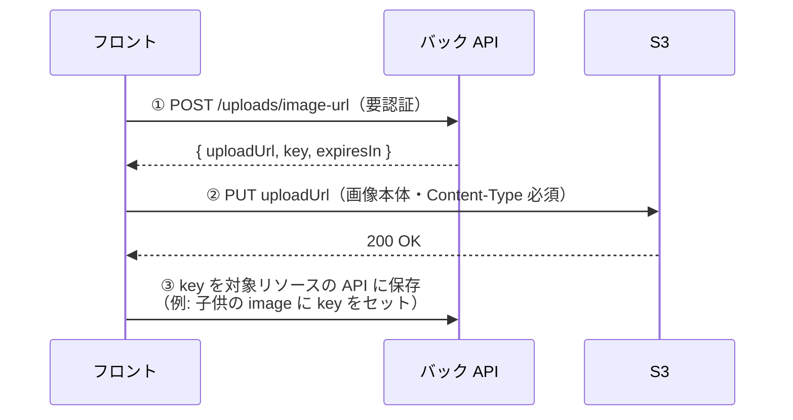

# 画像アップロード API（フロント連携ガイド）

フロントから S3 へ画像を直接アップロードするための、**署名付き URL 発行エンドポイント**の使い方。バックは「アップロード先の URL を発行する」だけで、画像本体はフロントが S3 へ直接 PUT する。

## 全体の流れ



ポイント:
- ① で受け取った **`key`** を、最終的に対象リソース（子供など）に保存する。`uploadUrl` は一時的なものなので保存しない。
- ② は **バックを経由しない**（S3 へ直接）。サイズ制限・Lambda 負荷を避けるため。
- ③ の「key をどこに保存するか」は対象リソース側の API（子供 CRUD 等）の話。本ドキュメントは ①② が対象。

---

## ① 署名付き URL の発行

### リクエスト

```
POST /uploads/image-url
Authorization: Bearer <Cognito アクセストークン>
Content-Type: application/json
```

```jsonc
{
  "purpose": "child",          // 用途。現状は "child" のみ
  "targetId": "<childId>",     // 対象の ID（purpose=child なら子供の id）
  "contentType": "image/jpeg"  // アップロードする画像の MIME タイプ
}
```

| フィールド | 必須 | 説明 |
|---|---|---|
| `purpose` | ✅ | 画像の用途。**現状 `"child"` のみ**対応（今後アルバム・離乳食などを追加予定）。 |
| `targetId` | ✅ | 対象リソースの ID。`purpose="child"` のときは子供の `id`。**本人の所有物でないと 404**。 |
| `contentType` | ✅ | 画像の MIME タイプ。許可は **`image/jpeg` / `image/png` / `image/webp`** のみ。 |

### レスポンス（200）

```jsonc
{
  "uploadUrl": "https://growth-diary-images-....s3.ap-northeast-1.amazonaws.com/children/<childId>/<uuid>.jpg?X-Amz-...",
  "key": "children/<childId>/<uuid>.jpg",  // ← これを後で対象リソースに保存する
  "expiresIn": 300                          // uploadUrl の有効期限（秒）
}
```

### エラー

| ステータス | 条件 |
|---|---|
| `400` | `purpose` / `targetId` / `contentType` のいずれか欠落 |
| `400` | 未対応の `purpose` |
| `400` | 未対応の `contentType`（jpeg / png / webp 以外） |
| `401` | 未認証（トークン無し・不正・期限切れ） |
| `404` | `targetId` が本人の所有物でない、または存在しない |

---

## ② S3 への直接アップロード（PUT）

①で受け取った `uploadUrl` に、画像ファイルを **PUT** する。

> ⚠️ **`Content-Type` ヘッダは①で送った `contentType` と完全一致**させること。署名に焼き込まれているため、違うと S3 が `403 SignatureDoesNotMatch` を返す。

```ts
// file: ユーザーが選択した File（input[type=file]）
await fetch(uploadUrl, {
  method: "PUT",
  headers: { "Content-Type": file.type }, // ①の contentType と一致させる
  body: file,
});
```

成功すると S3 が `200` を返す。以降は `key` を対象リソースに保存する（③）。

---

## フロント実装サンプル（①→②）

```ts
/**
 * 子供の画像を S3 にアップロードし、保存用の key を返す。
 * @param childId 対象の子供 id
 * @param file アップロードする画像ファイル
 * @returns S3 オブジェクトキー（DB 保存用）
 */
async function uploadChildImage(childId: string, file: File): Promise<string> {
  // ① 署名付き URL を発行（api クライアントは Authorization を付与する前提）
  const { uploadUrl, key } = await api.post("/uploads/image-url", {
    purpose: "child",
    targetId: childId,
    contentType: file.type,
  });

  // ② S3 へ直接 PUT（Content-Type は①と一致させる）
  const res = await fetch(uploadUrl, {
    method: "PUT",
    headers: { "Content-Type": file.type },
    body: file,
  });
  if (!res.ok) throw new Error(`画像のアップロードに失敗しました: ${res.status}`);

  // ③ 呼び出し側で key を子供リソースに保存する
  return key;
}
```

---

## 環境・前提

| 項目 | 値 |
|---|---|
| ローカル API ベース | `http://localhost:3000` |
| 本番 API ベース | `https://h9nyg3tm0j.execute-api.ap-northeast-1.amazonaws.com/Prod/` |
| 認証 | Cognito アクセストークンを `Authorization: Bearer <token>` で送る |
| S3 CORS 許可オリジン | ローカルは `http://localhost:5173`（本番ドメインは決定後にバック側で追加） |

---

## 未提供（今後のチケット）

- **画像の表示用 URL**（GET 署名 URL）— #70 手順4 で提供予定。現状バケットは非公開なので、表示が必要になったら別途追加する。
- **ファイルサイズ上限の強制** — #70 手順5。現状フロント側で事前バリデーションを推奨。
- **`child` 以外の purpose**（アルバム・離乳食など）— 対象リソースの実装にあわせて順次追加。
