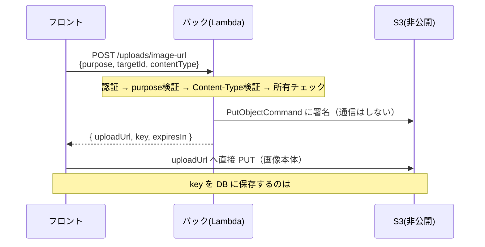

# 変更解説: 画像アップロード用 署名付き URL 発行エンドポイント（#70 手順2）

## 全体像

フロントが S3 へ画像を直接アップロードできるよう、**バックが「署名付き PUT URL」を発行するエンドポイント**を追加した。署名付き URL とは、一時的に S3 への特定操作だけを許可する署名入り URL のこと。アップロード処理そのものはフロント（#70 手順3）で行い、ここは「要認証・所有チェックつきで URL を発行する」部分だけを実装している。



## 設計の方針

「アルバム・離乳食など今後あちこちで画像を使う」ため、**共通化**を意識した構成にしている。

- **共通部分**（署名生成・Content-Type 検証）は `upload.service.ts` に集約
- **用途ごとに違う部分**（所有チェック・キーの置き場所）は `uploads.route.ts` の `UPLOAD_PURPOSES` レジストリにデータとして定義 → 新用途は1件足すだけ

## 変更ファイル一覧

| ファイル | 変更内容 |
|----------|----------|
| package.json / package-lock.json | S3 SDK（`@aws-sdk/client-s3` / `@aws-sdk/s3-request-presigner`）を追加 |
| src/config/s3.ts | バケット名を env から読む（新規） |
| src/plugins/s3.ts | `S3Client` を生成（新規） |
| src/services/upload.service.ts | 署名付き URL 生成・Content-Type 検証（新規・共通処理） |
| src/routes/uploads.route.ts | `POST /uploads/image-url`・用途レジストリ（新規） |
| src/app.ts | uploads ルートを登録 |
| test/integration/uploads.test.ts | エンドポイントの integration テスト（新規） |

## 詳細解説

### 1. src/config/s3.ts（バケット名）

```ts
export const IMAGES_BUCKET = process.env.IMAGES_BUCKET ?? "growth-diary-images-local";
```

どのバケットに署名するかを env から取るための定数。本番（Lambda）では template.yaml が `IMAGES_BUCKET` を渡す（#69 で設定済み）。ローカル/テストでは未設定なのでデフォルト名を使う。既存の `config/dynamodb.ts`（`TABLES`）と同じ「env 優先・デフォルトあり」の型。

### 2. src/plugins/s3.ts（S3 クライアント）

```ts
export const s3 = new S3Client(
  process.env.S3_ENDPOINT ? { endpoint: process.env.S3_ENDPOINT, forcePathStyle: true } : {}
);
```

S3 への接続クライアント。`config/dynamodb.ts` の作りに揃えて、`S3_ENDPOINT` があればそこへ（将来ローカルの S3 エミュレータ用）、無ければ実 S3 に接続する。リージョンと認証情報は SDK が env（`AWS_REGION` 等）やロールから自動で読む。

### 3. src/services/upload.service.ts（共通処理）

用途を問わず使う「署名生成」と「Content-Type 検証」をまとめたファイル。

#### 許可形式の定義（L9-15）

```ts
const ALLOWED_IMAGE_TYPES = {
  "image/jpeg": "jpg",
  "image/png": "png",
  "image/webp": "webp",
} as const;
type AllowedImageType = keyof typeof ALLOWED_IMAGE_TYPES;
```

Content-Type → 拡張子の対応表を1か所に持つ（単一情報源）。`as const` で値を固定し、`keyof typeof` で「許可された Content-Type だけ」を表す型 `AllowedImageType` を導出している。許可形式を増やすならこの表に1行足すだけ。

#### isAllowedImageType（L31-36 / 型ガード）

```ts
return Object.hasOwn(ALLOWED_IMAGE_TYPES, contentType);
```

クライアントの文字列が許可形式かを判定する型ガード（戻り値 `contentType is AllowedImageType`）。`in` 演算子ではなく `Object.hasOwn` を使うのが重要。`in` は `constructor` などプロトタイプのプロパティまで `true` にしてしまい、ホワイトリストをすり抜けるため（コードレビュー指摘を反映）。

#### createImageUploadUrl（L44-62 / 署名生成）

```ts
const key = `${keyPrefix}/${randomUUID()}.${extension}`;
const command = new PutObjectCommand({ Bucket: IMAGES_BUCKET, Key: key, ContentType: contentType });
const uploadUrl = await getSignedUrl(s3, command, { expiresIn: UPLOAD_URL_EXPIRES_IN });
```

キーを `接頭辞/UUID.拡張子` で採番し、`PutObjectCommand`（PUT したいという指示オブジェクト）に署名して URL を作る。`getSignedUrl` は AWS へ通信せずローカルで署名する。`ContentType` を署名に焼き込むので、フロントは同じ Content-Type ヘッダでしか PUT できない（差し替え防止）。有効期限は 300 秒で悪用の窓を狭めている。

### 4. src/routes/uploads.route.ts（エンドポイント＋用途レジストリ）

#### UPLOAD_PURPOSES レジストリ（L14-22）

```ts
const UPLOAD_PURPOSES: Record<string, UploadPurpose> = {
  child: {
    verifyOwnership: async (userId, targetId) => (await findChildByIdForUser(targetId, userId)) !== null,
    buildKeyPrefix: (targetId) => `children/${targetId}`,
  },
};
```

用途ごとに「所有チェック関数」と「キー接頭辞の作り方」を持つデータ表。現在は `child`（子供の画像）だけ。アルバムなら `album: { verifyOwnership: 投稿が本人か, buildKeyPrefix: () => 'albums/...' }` を足すだけで対応できる、という拡張ポイント。

#### ハンドラの流れ（L32-66 / ガード節の連続）

処理を冒頭のガード節（早期リターン）で組み立てている。順に:

1. `purpose / targetId / contentType` が揃っているか → 無ければ 400
2. `Object.hasOwn(UPLOAD_PURPOSES, purpose)` で対応 purpose か → 違えば 400（`in` 同様のプロトタイプ取得を避けるため `hasOwn` を使用。レビュー指摘反映）
3. `isAllowedImageType(contentType)` で許可形式か → 違えば 400
4. `verifyOwnership(...)` で本人の対象か → 違えば **404**（403 でなく 404 にして「他人の対象が存在すること」自体を隠す。既存 `verifyChildOwnership` と同じ方針）
5. すべて通れば `createImageUploadUrl` で URL を発行して返す

### 5. src/app.ts（ルート登録）

```ts
fastify.register(uploadsRoutes, { prefix: "/uploads" });
```

`/uploads` プレフィックスで登録。グローバルの認証フックが効くので（`PUBLIC_PATHS` に無い）、`request.user` は保証される。

### 6. test/integration/uploads.test.ts

既存 `children.test.ts` と同じく実 DynamoDB Local（testcontainers）で動かす integration テスト。正常系（200・キー形式・署名）に加え、400 系（必須欠け・未対応 purpose・未対応 Content-Type）、404 系（他人・存在しない）、さらにレビュー指摘の `constructor` を渡すケース（purpose / contentType 両方）で 400 になることを検証している。

## スコープ外（このチケットでやっていないこと）

- フロントのアップロード実装・key の DB 保存（#70 手順3）
- 表示用の GET 署名 URL（#70 手順4）
- サイズ上限（#70 手順5）。**PUT 署名では容量制限を強制できない**ため、必要なら presigned POST への変更を別途検討する。
