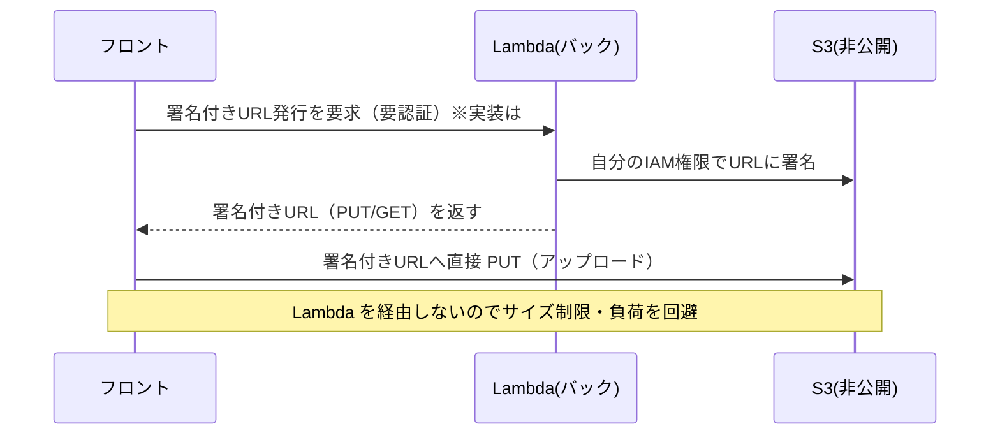

# 変更解説: 画像保存用 S3 バケットの定義（#69）

## 全体像

#23 の画像アップロードに備え、画像を保存する**非公開 S3 バケット**を SAM（[template.yaml](../../template.yaml)）に定義した。バケット本体・CORS・暗号化・Lambda への権限・バケット名の環境変数注入までを IaC（コードによるインフラ定義）でまとめている。アップロード処理の実装本体は #70 のスコープで、ここはインフラ定義のみ。

変更ファイルは `template.yaml` の 1 件。論理的な変更は 5 か所。

## なぜこの構成か（署名付き URL モデル）

バケットは**完全非公開**にして、アップロードも閲覧も「Lambda が発行する署名付き URL（presigned URL）」経由だけに限定する。署名付き URL とは、一時的に S3 への特定操作（PUT/GET）を許可する署名入りの URL のこと。これにより、子供のプライベートな写真が URL を知られただけで公開される事故を防ぐ。



## 変更ファイル一覧

| ファイル | 変更内容 |
|----------|----------|
| template.yaml | S3 バケット定義・CORS 用 Parameter・Lambda への権限と環境変数・Output を追加 |

## 詳細解説

### 1. Parameter `AllowedOrigin` の追加（L10-13）

```yaml
  AllowedOrigin:
    Type: String
    Default: http://localhost:5173
    Description: Allowed origin for the images bucket CORS (frontend direct upload)
```

CORS（ブラウザが別オリジンへリクエストする際の許可設定）で「どのオリジンからの直接アップロードを許すか」を、コードを書き換えずに deploy 時へ外出しするためのパラメータ。デフォルトはローカル開発の `http://localhost:5173`。本番フロントの URL が決まれば `sam deploy --parameter-overrides "AllowedOrigin=https://<本番ドメイン>"` で上書きできる。

> 補足: もともと複数オリジンを渡せる `CommaDelimitedList` で書いたが、IDE の静的スキーマ検証が `!Ref`（リスト）を配列と認識できず誤検知が出たため、`String`（1 オリジン）に変更し CORS 側で配列リテラルに包む形にした。環境ごとに 1 オリジン指定で運用すれば十分。

### 2. `ImagesBucket` リソースの追加（L83-114）

S3 バケット本体の定義。4 つのまとまりで構成される。

```yaml
  ImagesBucket:
    Type: AWS::S3::Bucket
    Properties:
      BucketName: !Sub growth-diary-images-${AWS::AccountId}
```

- **バケット名**: `!Sub` は文字列に変数を埋め込む CloudFormation の組み込み関数。`${AWS::AccountId}` は実行中の AWS アカウント ID に置き換わる（今回は `growth-diary-images-108917201039`）。S3 バケット名は**全世界で一意**にする必要があるため、アカウント ID を付けて衝突を避けている。

```yaml
      PublicAccessBlockConfiguration:
        BlockPublicAcls: true
        BlockPublicPolicy: true
        IgnorePublicAcls: true
        RestrictPublicBuckets: true
```

- **パブリックアクセスブロック**: 4 項目すべて `true` で、誤って公開設定をしても効かないように二重で塞ぐ。署名付き URL モデルの土台。

```yaml
      BucketEncryption:
        ServerSideEncryptionConfiguration:
          - ServerSideEncryptionByDefault:
              SSEAlgorithm: AES256
```

- **暗号化**: 保存データを AES256 でサーバーサイド暗号化。既存の DynamoDB テーブル（`SSEEnabled: true`）と方針を揃えている。

```yaml
      CorsConfiguration:
        CorsRules:
          - AllowedOrigins:
              - !Ref AllowedOrigin
            AllowedMethods: [GET, PUT, HEAD]
            AllowedHeaders: ["*"]
            ExposedHeaders: [ETag]
            MaxAge: 3000
```

- **CORS**: フロントが S3 へ**直接** `PUT`（アップロード）/ `GET`（表示）/ `HEAD` できるよう許可。`AllowedOrigins` に Parameter `AllowedOrigin` を 1 要素の配列として渡す。`ETag` を公開するのはアップロード結果の検証用、`MaxAge: 3000` はプリフライト結果を 3000 秒キャッシュしてリクエストを減らすため。

### 3. Lambda 環境変数 `IMAGES_BUCKET` の追加（L144-145）

```yaml
          IMAGES_BUCKET:
            Ref: ImagesBucket
```

`Ref: ImagesBucket` はバケットの**実名**（`growth-diary-images-108917201039`）を返す。バックのコード（#70 で実装）が「どのバケットに署名するか」を知るための環境変数。#69 の完了目安「バケット名がバックに設定されている」を満たす部分。

### 4. Lambda への S3 権限付与（L159-162）

```yaml
        - S3CrudPolicy:
            BucketName:
              Ref: ImagesBucket
```

`S3CrudPolicy` は SAM が用意する権限テンプレート（ポリシーテンプレート）で、指定バケットへの読み書き権限を Lambda の実行ロールに付与する。署名付き URL は「発行者（Lambda）自身が持つ権限の範囲」でしか有効にならないため、この権限がないとアップロード用 URL を発行しても実際の PUT が拒否される。

### 5. Output `ImagesBucketName` の追加（L221-224）

```yaml
  ImagesBucketName:
    Description: "S3 bucket name for images"
    Value:
      Ref: ImagesBucket
```

デプロイ後にバケット名を CLI（`sam deploy` の出力や `describe-stacks`）で取り出せるようにする。他のリソース（フロントの設定など）から参照する際の入口。

## スコープ外（あえてやっていないこと）

- **公開バケットポリシーは作っていない**。非公開＋署名付き URL モデルでは IAM 権限（手順 4）で十分なため。issue の「バケットポリシー」項目はこのモデルでは「パブリックアクセスブロック＋IAM」で代替している。
- **署名付き URL 発行エンドポイントの実装**は #70 のスコープ。
