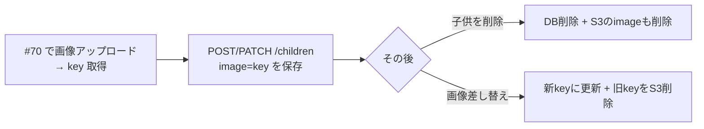

# 変更解説: 子供に画像（image）を持たせ、S3 の後始末をする（#23）

## 全体像

子供 CRUD に**画像（写真）**を組み込む変更。Child に `image`（#70 でアップロードした S3 オブジェクトキー）を持たせ、登録/取得/更新/削除で扱えるようにした。あわせて、**子供削除・画像差し替え時に S3 の実体も削除**して孤児オブジェクト（DB から参照されないのに残るファイル）が溜まらないようにした。



## データの流れ（誰が key を持つか）

1. フロントが [/uploads/image-url](../api/image-upload-url.md) で署名付き URL を取得し、S3 へ直接 PUT（#70）
2. 返ってきた `key` を子供の `image` として保存（今回の変更）
3. 子供を消す／写真を変えると、不要になった S3 オブジェクトも削除（今回の変更）

## 変更ファイル一覧

| ファイル | 変更内容 |
|----------|----------|
| src/types/models.ts | `Child` に `image?` を追加 |
| src/repositories/children.repository.ts | create/update で image 保存、delete 時に旧データを返す |
| src/services/upload.service.ts | `deleteImage`（S3 削除）を追加 |
| src/services/children.service.ts | image 受け渡し＋S3 後始末のロジック |
| test/integration/children.test.ts | image の保存/未指定/PATCH の3ケース |
| test/integration/children-image-cleanup.test.ts | S3 後始末の4ケース（upload.service をモック） |

## 詳細解説

### 1. src/types/models.ts（型の土台）

```ts
image?: string; // S3 オブジェクトキー（#70 でアップロードした画像）。未設定可。
```

Child に任意の `image` を追加。保存するのは**画像本体ではなく S3 のキー文字列**（例: `children/<childId>/<uuid>.jpg`）。`?`（任意）なので、写真なしの子供も表せる。

### 2. src/repositories/children.repository.ts（永続化）

#### create / update に image を追加

`createChild` の入力と `updateChildForUser` の `data` に `image?` を足しただけ。`createChild` では `image: input.image` を Item に渡すが、**未指定（undefined）なら DynamoDB クライアントの `removeUndefinedValues` で自動的に除外**されるため、写真なしの子供には image 属性が付かない。

#### deleteChildForUser の戻り値を変更（boolean → Child | null）

```ts
ReturnValues: "ALL_OLD",
...
return (result.Attributes as Child) ?? null;
```

削除した子供の**画像キーを後で S3 削除に使う**ため、`DeleteCommand` に `ReturnValues: "ALL_OLD"` を付けて削除前の中身を取得して返す形にした。`ALL_OLD` は「削除直前のアイテム全体」を返す DynamoDB のオプション。対象が無いとき（条件失敗）は `null`。

### 3. src/services/upload.service.ts（S3 削除の共通化）

```ts
export async function deleteImage(key: string): Promise<void> {
  await s3.send(new DeleteObjectCommand({ Bucket: IMAGES_BUCKET, Key: key }));
}
```

S3 の削除操作を upload.service に集約（アップロード系と同じ場所に置く）。権限は #69 で付与済みの `S3CrudPolicy`（`s3:DeleteObject` を含む）でまかなう。

### 4. src/services/children.service.ts（中心ロジック）

#### deleteImageIfPresent（ベストエフォート削除）

```ts
async function deleteImageIfPresent(key: string | undefined): Promise<void> {
  if (!key) return;
  try {
    await uploadService.deleteImage(key);
  } catch (error) {
    console.error(`S3 画像の削除に失敗しました: ${key}`, error);
  }
}
```

「key があれば S3 から消す。失敗してもリクエストは止めない」を1か所にまとめたヘルパー。**DB を正とし、S3 削除は後追い**という方針。S3 削除に失敗しても子供の削除・更新そのものは成功扱いにして、ログだけ残す（S3 の一時障害で本処理を巻き込まないため）。

#### replaceChild / updateChild（差し替え時の旧画像削除）

両関数とも `Promise` を返す **async 関数に変更**し、共通のパターンを入れた:

```ts
const current = await ...findChildByIdForUser(childId, userId); // 更新前の状態
const updated = await ...updateChildForUser(childId, userId, { ..., image: input.image });
if (updated && current?.image && current.image !== updated.image) {
  await deleteImageIfPresent(current.image); // 画像が変わったときだけ旧画像を削除
}
```

ポイントは `current.image !== updated.image` の比較。**画像が実際に差し替わったときだけ**旧画像を消す。画像を触らない更新（名前だけ変更など）では `current.image === updated.image` になるので S3 は触らない。更新前の状態を知るために更新前に1回 `findChildByIdForUser` している。

#### deleteChild（削除時の画像削除）

```ts
const deleted = await ...deleteChildForUser(childId, userId); // Child | null になった
if (!deleted) return false;
await growthRepository.deleteAllGrowthsByChild(childId); // 既存: 成長記録のカスケード削除
await deleteImageIfPresent(deleted.image);               // 追加: 画像も削除
return true;
```

`deleteChildForUser` が削除した子供を返すようになったので、その `image` を使って S3 も掃除する。既存の「成長記録のカスケード削除」と同じ並びに1行足した形。戻り値は従来どおり boolean（route は変更不要）。

### 5. テスト

- **children.test.ts**: image を保存して GET で返ること、未指定なら image を持たないこと、PATCH で後付けできること。
- **children-image-cleanup.test.ts**: 実 S3 を叩かないよう `upload.service` を `vi.mock` でモックし（DynamoDB は実 Local を使用）、「image つき削除 → deleteImage 呼ぶ」「image なし削除 → 呼ばない」「差し替え → 旧 key で呼ぶ」「画像不変の更新 → 呼ばない」を検証。

## スコープ外

- **「写真を外す」操作**（image を空にする）は未対応。今の PATCH は「省略フィールドは変更しない」仕様なので、明示的な削除シグナル（`image: null` 等）の追加が必要。UI に外すボタンが必要になったときに、差し替えの仕組みを流用して追加する。
- 表示用 GET 署名 URL は #70 手順4 のまま別スコープ。
