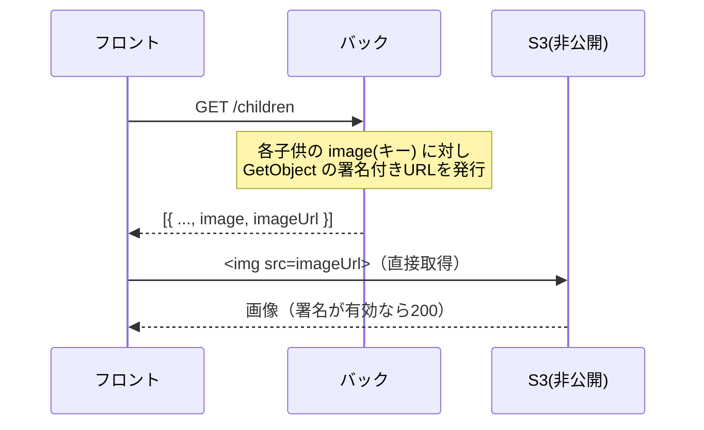

# 変更解説: 子供レスポンスに表示用の署名付き URL（imageUrl）を追加（#23 / #70手順4）

## 全体像

非公開バケットに保存した子供の画像をフロントで表示できるよう、子供を返す全 API のレスポンスに **`imageUrl`（表示用の署名付き GET URL）** を都度付与する変更（A案）。フロントは `child.imageUrl` を `` に入れるだけで表示でき、追加リクエストは不要。



## なぜ必要か

バケットは完全非公開（パブリックアクセスブロック）なので、`image`（S3 キー）だけでは画像 URL が作れない。閲覧には、その都度サーバーが発行する**署名付き GET URL** が要る。アップロード（#70手順2）が `PutObjectCommand` を署名していたのに対し、表示は `GetObjectCommand` を署名する。

## 変更ファイル一覧

| ファイル | 変更内容 |
|----------|----------|
| src/services/upload.service.ts | 表示用の署名付き GET URL 発行 `createImageViewUrl` を追加 |
| src/services/children.service.ts | レスポンスに `imageUrl` を付与（型・マッパー・各関数の enrich） |
| test/integration/children.test.ts | imageUrl の付与/null を検証 |
| test/integration/children-image-cleanup.test.ts | モック追加＋発行失敗時の best-effort を検証 |

## 詳細解説

### 1. src/services/upload.service.ts（署名 URL の発行）

```ts
const VIEW_URL_EXPIRES_IN = 900; // 15分

export async function createImageViewUrl(key: string): Promise<string> {
  const command = new GetObjectCommand({ Bucket: IMAGES_BUCKET, Key: key });
  return getSignedUrl(s3, command, { expiresIn: VIEW_URL_EXPIRES_IN });
}
```

既存の S3 クライアント・`getSignedUrl` を再利用し、`GetObjectCommand`（取得操作）を署名する。アップロード用 `createImageUploadUrl`（PutObject・300秒）の表示版で、表示は画面が開いている間に切れにくいよう少し長め（900秒）。`getSignedUrl` は AWS へ通信せずローカルで署名する。

### 2. src/services/children.service.ts（レスポンスへの付与）

#### ChildResponse 型と attachImageUrl（L27-46）

```ts
export type ChildResponse = Child & { imageUrl: string | null };

async function attachImageUrl(child: Child): Promise<ChildResponse> {
  if (!child.image) return { ...child, imageUrl: null };
  try {
    const imageUrl = await uploadService.createImageViewUrl(child.image);
    return { ...child, imageUrl };
  } catch (error) {
    console.error(`表示用URLの発行に失敗しました: ${child.image}`, error);
    return { ...child, imageUrl: null };
  }
}
```

子供1件に `imageUrl` を付けるマッパー。要点:
- **image が無ければ `imageUrl: null`**（フィールド省略ではなく明示的に null）。
- **best-effort**: 署名発行が失敗しても例外を投げず `imageUrl: null` で返す。一覧の1件が失敗しても全体を落とさないため（後述の `Promise.all` が reject しない）。S3 後始末の `deleteImageIfPresent` と同じ「落とさず続行」方針。

```ts
function attachImageUrls(children: Child[]): Promise<ChildResponse[]> {
  return Promise.all(children.map(attachImageUrl));
}
```

一覧用。各子供の署名発行を **`Promise.all` で並列化**（直列だと件数分の待ちが積み上がるため）。`attachImageUrl` が必ず解決するので、Promise.all 全体が reject することはない。

#### 各エンドポイント関数の enrich（L60-159）

`listChildren` / `getChild` / `createChild` / `replaceChild` / `updateChild` を、リポジトリ結果に `attachImageUrl(s)` を通してから返すよう変更した。`listChildren`・`getChild`・`createChild` は元は同期関数（Promise を素通し）だったが、署名発行（await）が必要なため **async 化**。呼び出し元（route）はいずれも `await` 済みなので影響なし。`replaceChild`/`updateChild` は旧画像の S3 削除後に `attachImageUrl(child)` を返す（戻り値が `child` → `ChildResponse` に）。

### 3. テスト

- **children.test.ts**: image ありで `imageUrl` に署名（`X-Amz-Signature`）が入ること、image 無しで `imageUrl` が `null` になることを検証。署名はオフライン生成なので実 S3 通信なし。
- **children-image-cleanup.test.ts**: モックに `createImageViewUrl` を追加。さらに **「発行を1件だけ失敗させても `GET /children` が 200 で、その子は `imageUrl: null`」** という best-effort の回帰テストを追加。

## 補足

- 所有チェックは既存どおり（list/get は本人の子のみ）。署名対象も本人のキーだけなので追加の権限制御は不要。
- 署名 URL は毎レスポンスで新規発行（キャッシュしない）。フロントは受け取った `imageUrl` をそのまま使う。
- 権限は #69 で付与済みの `S3CrudPolicy`（`s3:GetObject` を含む）でカバー。
