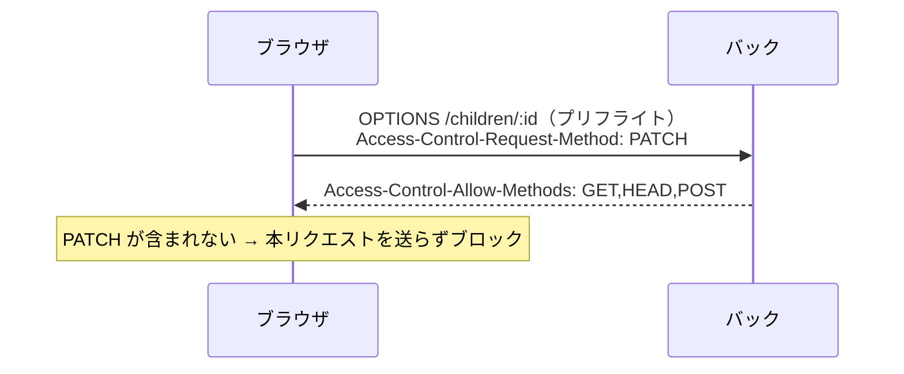

# 変更解説: CORS で更新系メソッド（PUT/PATCH/DELETE）を許可する

## 全体像

フロントからの編集（PATCH）・削除（DELETE）が **CORS プリフライトで弾かれていた**問題の修正。`@fastify/cors` の `methods` 既定値が `GET,HEAD,POST` のみで、更新系メソッドが許可されていなかったため、`methods` を明示的に指定した。

## 背景（なぜ起きたか）

ブラウザは「単純リクエスト」以外（PATCH/PUT/DELETE や JSON body 付きなど）を送る前に、`OPTIONS` の**プリフライトリクエスト**で「そのメソッドを使ってよいか」をサーバーに確認する。サーバーが返す `Access-Control-Allow-Methods` に対象メソッドが含まれていないと、本リクエストは送られずブロックされる。

今回、フロントの E2E で PATCH/DELETE が次のエラーで失敗していた:

```
Method PATCH is not allowed by Access-Control-Allow-Methods in preflight response
```

調査すると `@fastify/cors` v11 の `methods` 既定値が `'GET,HEAD,POST'`（`node_modules/@fastify/cors/index.js`）で、POST までしか許可していなかった。`{ origin }` だけ渡すと全メソッド許可になるという思い込みが原因。



## 変更ファイル一覧

| ファイル | 変更内容 |
|----------|----------|
| src/app.ts | CORS 登録に `methods`（更新系含む）を明示 |
| test/integration/cors.test.ts | プリフライトに PUT/PATCH/DELETE が含まれることを検証（新規） |

## 詳細解説

### 1. src/app.ts（CORS 設定）

```ts
fastify.register(cors, {
  origin: LOCAL_FRONTEND_ORIGIN,
  methods: ["GET", "HEAD", "POST", "PUT", "PATCH", "DELETE"],
});
```

`methods` を明示し、children / growth の更新系（PUT/PATCH/DELETE）と既存の GET/POST をすべて許可する。`OPTIONS` 自体は `@fastify/cors` が横断的に処理するため、リストに含める必要はない。CORS をルート・認証フックより先に登録している点は従来どおり（プリフライトが認証で弾かれないようにするため）。

### 2. test/integration/cors.test.ts（回帰防止）

`app.inject` で `OPTIONS /children/x` をプリフライトとして送り、`access-control-allow-methods` に `PUT` / `PATCH` / `DELETE` が含まれることを検証する。CORS の許可はルート実体に依存せず横断的に処理されるため、ルートの有無に関係なくプリフライト応答だけを確認している。

## 補足

- 反映には**コンテナ再起動**が必要だった（Docker Desktop + WSL のマウント越しで tsx watch がファイル変更を拾わないことがあるため）。
- 本番フロントのオリジン許可は別途（`origin` の設定）。今回は `methods` のみの修正。
