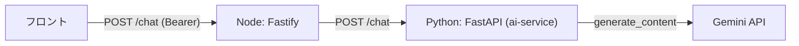

# 変更解説: AIボット(Gemini)を Python サービスとして分離し Node が中継する（#30・バックエンド）

## 全体像

相談ページの AI ボットを実装するにあたり、**AI 処理を Python(FastAPI) の独立サービスに分離**し、**Node(メインAPI)が認証つきで中継**する構成にした。今後 Python での独自処理（RAG 等）に拡張しやすくするのが狙い。



- 認証・入口は Node が担当（既存のグローバル認証フックで `/chat` もログイン必須）。
- Python はブラウザから直接叩かれない**内部サービス**（CORS 不要）。

## 変更ファイル一覧

| ファイル | 変更内容 |
|----------|----------|
| ai-service/main.py | FastAPI で Gemini を呼ぶ最小サービス（新規・ルート直下から移設） |
| ai-service/requirements.txt 等 | 依存・Dockerfile・.env.example・.gitignore・.dockerignore（新規） |
| src/config/ai.ts | AI サービスのベースURL（新規） |
| src/services/chat.service.ts | Python へ HTTP 中継（新規） |
| src/routes/chat.route.ts | `POST /chat` エンドポイント（新規） |
| src/app.ts | chat ルート登録 |
| compose.yml | ai-service サービス追加・app へ AI_SERVICE_URL 注入 |
| .env.example / .gitignore | AI 関連 env・Python 成果物の無視 |
| test/integration/chat.test.ts | /chat の中継・バリデーション・失敗系テスト（新規） |

## 詳細解説

### 1. ai-service/main.py（Python AI サービス）

Gemini を呼ぶ最小の FastAPI アプリ。レビューを反映して堅牢化した。

#### 起動時の API キー検証（L11-14）

```python
API_KEY = os.getenv("GOOGLE_GEMINI_API_KEY")
if not API_KEY:
    raise RuntimeError("GOOGLE_GEMINI_API_KEY が設定されていません")
```

キー未設定のまま起動して「呼んだ時に分かりにくく失敗」を避けるため、**起動時に明確に落とす**（fail-fast）。

#### 入力バリデーション（ChatRequest）

```python
class ChatRequest(BaseModel):
    message: str = Field(min_length=1, max_length=4000)
```

pydantic の `Field` で空文字・過大入力を弾く。

#### /chat ハンドラ（同期 + エラー整形）

```python
@app.post("/chat", response_model=ChatResponse)
def chat(request: ChatRequest) -> ChatResponse:
    try:
        response = client.models.generate_content(model=MODEL, contents=request.message)
    except Exception as error:
        raise HTTPException(status_code=502, detail="...") from error
    return ChatResponse(reply=response.text or "")
```

- **`def`（同期ハンドラ）**にしているのが要点。Gemini SDK の呼び出しは同期 I/O なので、`async def` 内で直接呼ぶとイベントループを塞ぐ。同期ハンドラなら FastAPI が**スレッドプールで実行**し、他リクエストを止めない。
- Gemini 側の失敗（レート制限・503 等）は **502 に丸めて**返す。
- `MODEL = "gemini-2.5-flash"`。当初の `gemini-2.5-flash-lite` は 503(高負荷)が頻発したため変更。
- **CORS ミドルウェアは付けない**（Node からのみ呼ばれる内部サービスのため）。

### 2. ai-service の構成ファイル

- `requirements.txt`: 依存をバージョン固定（fastapi / uvicorn / pydantic / google-genai / python-dotenv）。Dockerfile の `pip install -r` が参照。
- `Dockerfile`: `python:3.14-slim` で依存を入れ、`uvicorn main:app --port 8000` で起動。
- `.dockerignore`: venv / .env をイメージに焼かない。
- `.gitignore`: venv / __pycache__ / .env を無視。

### 3. src/config/ai.ts（接続先URL）

```ts
export const AI_SERVICE_URL = process.env.AI_SERVICE_URL ?? "http://localhost:8001";
```

中継先の Python サービス URL。compose 内は `http://ai-service:8000`（compose.yml が注入）、ホスト直実行は `http://localhost:8001`（8000 は DynamoDB Local が使用するためズラしている）。既存の `config/dynamodb.ts` と同じ「env 優先・デフォルトあり」の型。

### 4. src/services/chat.service.ts（HTTP 中継）

```ts
const res = await fetch(`${AI_SERVICE_URL}/chat`, {
  method: "POST",
  headers: { "Content-Type": "application/json" },
  body: JSON.stringify({ message }),
  signal: AbortSignal.timeout(AI_REQUEST_TIMEOUT_MS), // 15秒で打ち切り
});
if (!res.ok) throw new Error(`AI service responded ${res.status}`);
return (await res.json()) as ChatReply;
```

Node から Python へ転送する関数。Node 22 の標準 `fetch` を使用。**`AbortSignal.timeout` でタイムアウト**を付け、Python がハングしても Node のリクエストが無限待ちにならないようにしている（レビュー反映）。非2xx は例外にして呼び出し側で 502 に変換させる。

### 5. src/routes/chat.route.ts（エンドポイント）

```ts
const raw = request.body?.message;
if (typeof raw !== "string" || !raw.trim()) {
  return reply.code(400).send({ error: "message は必須です" });
}
const message = raw.trim();
try {
  return reply.send(await chatService.relayChat(message));
} catch (error) {
  request.log.error(error, "...");
  return reply.code(502).send({ error: "..." });
}
```

- **`typeof raw !== "string"` チェックが重要**。Fastify にスキーマ検証が無く body は実行時に任意の型なので、数値等が来たときに `.trim()` で 500 になるのを防ぎ、400 を返す（レビュー反映）。
- 中継失敗は 502 に整形＋ログ。
- 認証は app 全体のグローバルフックが効くため、このルートも**ログイン必須**（`PUBLIC_PATHS` 非該当）。

### 6. src/app.ts（ルート登録）

```ts
fastify.register(chatRoutes, { prefix: "/chat" });
```

既存ルート群と同じ並びに1行追加。

### 7. compose.yml（サービス統合）

- `ai-service` を追加（`build: ./ai-service`、ホスト `8001`→コンテナ `8000`、`GOOGLE_GEMINI_API_KEY` を渡す）。
- app に `AI_SERVICE_URL: http://ai-service:8000` と `depends_on: ai-service` を追加。
- コンテナ内 8000 は各コンテナで独立。ホスト側だけ dynamodb-local(8000) と衝突しないよう ai-service を 8001 にしている。

### 8. test/integration/chat.test.ts

`vi.stubGlobal("fetch", ...)` で AI サービスへの fetch をモックし（実 Gemini を呼ばない）、**中継 200 / 空文字 400 / 非文字列 400 / AI 失敗 502 / 接続失敗 502** を検証。

## 補足

- ライブ動作は `GOOGLE_GEMINI_API_KEY` を `.env` に設定 → `docker compose up -d --build` → `POST /chat` で確認（200＋応答を確認済み）。
- ai-service はソースをイメージに焼くため、コード変更時は `docker compose up -d --build ai-service` が必要（必要なら volume マウント＋`--reload` でホットリロード化も可能）。
